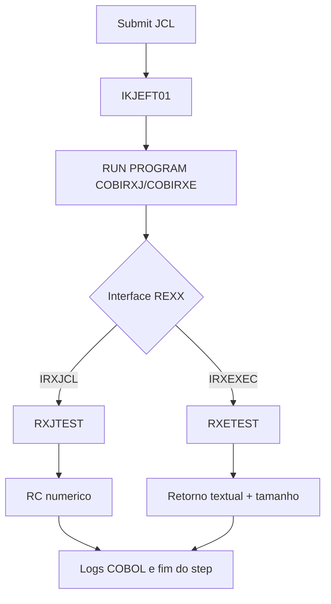

# COBOL Call REXX

## Objetivo

Documentar os módulos do exemplo e o fluxo de chamadas para execução em batch via `IKJEFT01`, cobrindo os cenários `IRXJCL` (simples) e `IRXEXEC` (flexível).

## Módulos e artefatos

### COBOL

- `examples/cobol/COBIRXJ.cbl`
  - Programa COBOL de entrada para o cenário `IRXJCL`.
  - Prepara uma string única de argumentos.
  - Chama `IRXJCL` para executar o membro REXX `RXJTEST`.
  - Lê e regista:
    - RC da API (`WS-API-RC`)
    - RC devolvido pelo REXX (`WS-RET-CODE`)
  - Propaga o resultado para `RETURN-CODE` do step.

- `examples/cobol/COBIRXE.cbl`
  - Programa COBOL para o cenário `IRXEXEC`.
  - Prepara:
    - `exec block` (`WS-EXEC-BLOCK`)
    - `evaluation block` (`WS-EVAL-BLOCK`)
    - tabela com múltiplos argumentos (`WS-ARG-TABLE`)
  - Chama `IRXEXEC` para executar o membro REXX `RXETEST`.
  - Lê e regista:
    - RC da API (`WS-API-RC`)
    - RC do exec (`WS-REXX-RC`)
    - comprimento do retorno textual (`WS-EVBK-RET-LEN`)
    - texto retornado (`WS-EVBK-RET-TEXT`)

### REXX

- `examples/rexx/RXJTEST.rexx`
  - Exec REXX usado por `IRXJCL`.
  - Recebe uma única string (`PARSE ARG allArgs`).
  - Regras de retorno:
    - sem argumentos -> `EXIT 4`
    - contém `ERRO` -> `EXIT 8`
    - caso normal -> `EXIT 0`

- `examples/rexx/RXETEST.rexx`
  - Exec REXX usado por `IRXEXEC`.
  - Recebe múltiplos argumentos (`p1 p2 p3`).
  - Constrói retorno textual no formato:
    - `OK|<p1>|<p2>|<p3>`
  - Devolve texto via `RETURN`, para leitura no evaluation block.

### JCL

- `examples/jcl/JCLRUNJ.jcl`
  - Executa `COBIRXJ` em `IKJEFT01`.
  - DDs principais:
    - `STEPLIB`: load modules COBOL
    - `SYSEXEC`: biblioteca dos membros REXX
    - `SYSTSIN`: `RUN PROGRAM(COBIRXJ)`

- `examples/jcl/JCLRUNE.jcl`
  - Executa `COBIRXE` em `IKJEFT01`.
  - DDs e padrão idênticos ao `JCLRUNJ`, com `RUN PROGRAM(COBIRXE)`.

- `examples/jcl/JCLSETUP.jcl`
  - Job de setup com cópia de membros REXX para PDS de execução.
  - Exemplo de compile/link COBOL via PROC local (ajustável ao ambiente).

## Fluxo de chamadas

### Fluxo 1: IRXJCL (simples)

1. Submit do `JCLRUNJ`.
2. `IKJEFT01` processa `SYSTSIN`.
3. `RUN PROGRAM(COBIRXJ)`.
4. `COBIRXJ` chama `IRXJCL`.
5. `IRXJCL` localiza e executa `RXJTEST` em `SYSEXEC`.
6. `RXJTEST` devolve RC numérico (`0`, `4`, `8`, ...).
7. `COBIRXJ` escreve logs e finaliza o step com o RC apropriado.

### Fluxo 2: IRXEXEC (flexível)

1. Submit do `JCLRUNE`.
2. `IKJEFT01` processa `SYSTSIN`.
3. `RUN PROGRAM(COBIRXE)`.
4. `COBIRXE` prepara `exec/eval blocks` e argumentos.
5. `COBIRXE` chama `IRXEXEC`.
6. `IRXEXEC` executa `RXETEST`.
7. `RXETEST` devolve texto por `RETURN`.
8. `COBIRXE` lê comprimento + conteúdo no evaluation block.
9. `COBIRXE` grava logs e finaliza com RC do exec (ou erro de API).

## Diagrama lógico

## DDNAMEs e pré-requisitos mínimos

- `STEPLIB` com loadlib dos programas COBOL.
- `SYSEXEC` com os membros REXX (`RXJTEST`, `RXETEST`).
- `SYSTSPRT`/`SYSPRINT` para diagnóstico.
- Ajuste de `HLQ`, PROC de compile/link e convenções locais.

## Critérios de validação

- `IRXJCL`: RC coerente com regra do `RXJTEST`.
- `IRXEXEC`: retorno textual presente e comprimento consistente.
- ambos os jobs executam sem abend.

## Troubleshooting rápido

- API-RC diferente de zero:
  - confirmar membro no `SYSEXEC`
  - confirmar nome exato do exec (8 chars)
  - validar concatenação de bibliotecas
- `RUN PROGRAM` falha:
  - confirmar módulo em `STEPLIB`
  - confirmar resultado do link-edit
- retorno textual vazio no `IRXEXEC`:
  - validar `RETURN` no `RXETEST`
  - validar mapeamento/tamanho do evaluation block
